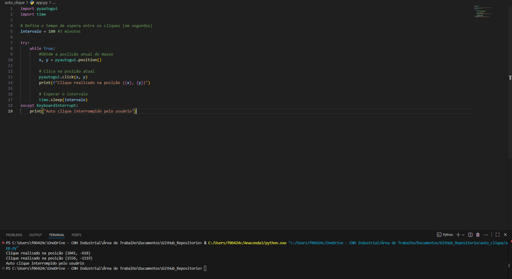

# 🖱️ Auto Clicker com Python

Este é um script simples de **auto clique** desenvolvido em Python.  
Ele realiza cliques automáticos na posição atual do mouse a cada intervalo de tempo definido pelo usuário.

## 🚀 Funcionalidades

- Captura a posição atual do mouse.  
- Executa cliques automáticos no mesmo ponto da tela.  
- Intervalo configurável entre os cliques (em segundos).  
- Pode ser interrompido a qualquer momento com **Ctrl + C** no terminal.  

## 📋 Pré-requisitos

Antes de executar, certifique-se de ter instalado:

- Python 3.x  
- Biblioteca `pyautogui`  

Para instalar a biblioteca:

```bash
pip install pyautogui
```

---

## ▶️ Como usar

1) Clone este repositório:
```bash
git clone https://github.com/seu-usuario/seu-repositorio.git
```
2) Acesse a pasta do projeto:
```bash
cd seu-repositorio
```
3) Execute o script:
```bash
python app.py
```
4) O programa começará a clicar automaticamente na posição atual do mouse a cada 3 minutos (180 segundos).

Você pode alterar o valor do intervalo editando esta linha no código:
```bash
intervalo = 180  # tempo em segundos
```
5) Para interromper a execução, pressione **Ctrl + C** no terminal.

---

## 📸 Demonstração

Execução no terminal




---

## ⚠️ Aviso

 - Use este script com responsabilidade.

 - Dependendo do contexto, auto clickers podem ser proibidos em certos softwares, sistemas ou jogos.

---

 ## 📜 Licença

Este projeto é de uso livre para fins de aprendizado e compartilhamento. 🚀